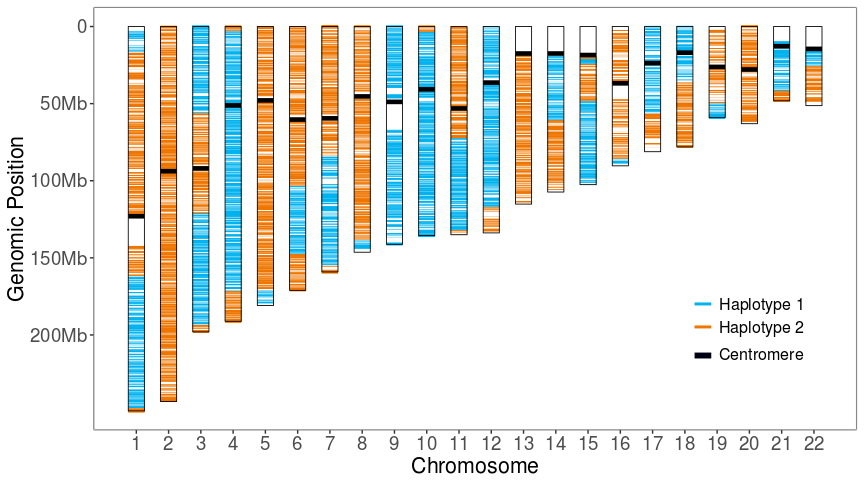
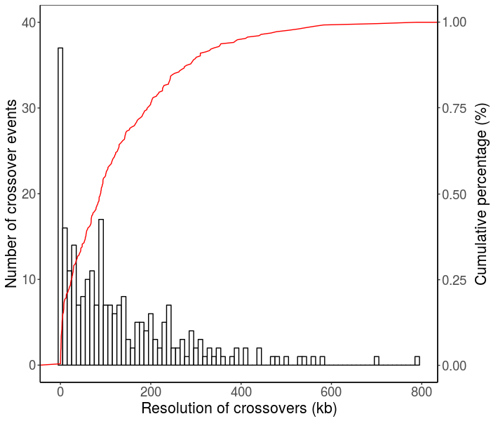
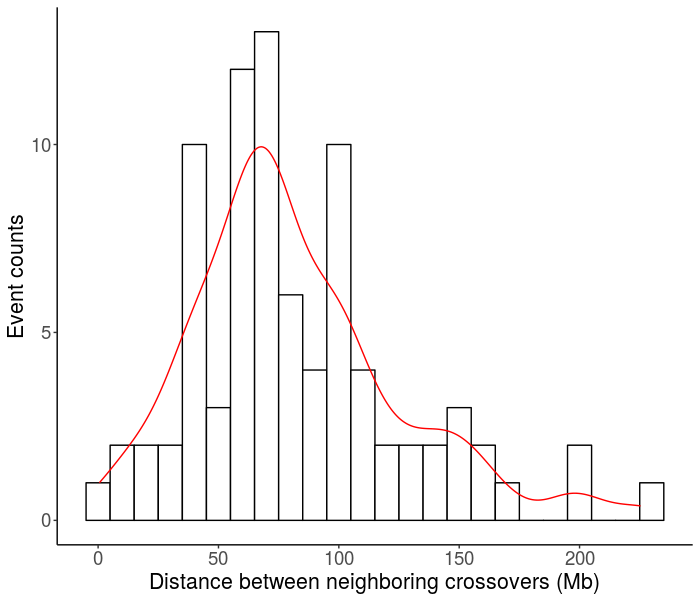
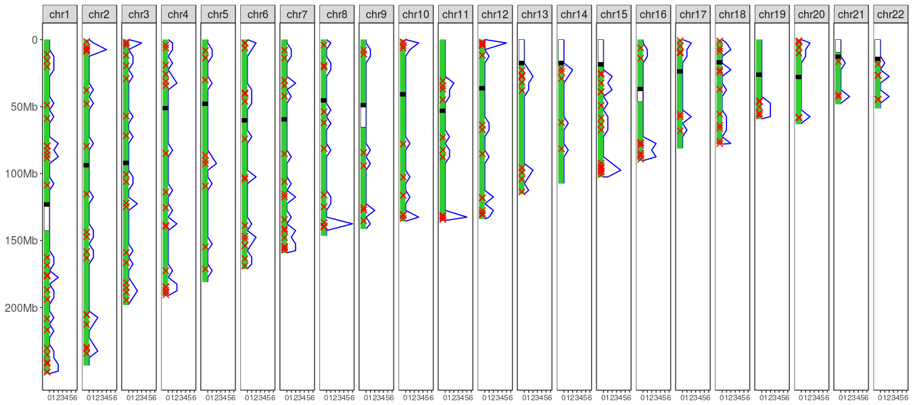

# Introduction

The knowledge of **complete** rather than fragmental **haplotypes** is **critical in many areas of genetics studies and will advance personalized medicine** including imputation of low-frequent variants, characterization of variant-disease associations, prediction of the clinical outcomes in tranplantation, drug response, and susceptibility to diseases, etc.

Population-based computational phasing methods cannot infer high-resolution haplotypes at chromosome-length and are not able to phase *de novo* mutations and rare variants, whereas existing experimental phasing methods usually require specialized equipment to separate single chromosomes, which is time-consuming and expensive. Whole-chromosome haplotype phasing with single diploid cells, either require a large number of sequencing libraries or need the assistance of long-read sequencing technologies to phase dense haplotypes at high accuracy thus makes it infeasible for large-scale applications. Using an individual’s genomic data of **single haploid gamete cells** provides a promising approach to overcome limitations in other methods for **chromosome-length haplotype phasing**.

`Hapi` a novel easy-to-use and high-efficient algorithm that only requires **3 to 5 gametes** to reconstruct accurate and high-resolution haplotypes of an individual. The gamete genotype data may be generated from **various platforms including genotyping arrays and next generation sequencing even with low-coverage**. `Hapi` simply takes genotype data of known hetSNPs in single gamete cells as input and report the high-resolution haplotypes as well as the confidence level of each phased hetSNPs. The package also includes a module allowing **downstream analyses and visualization of identified crossovers** in the gametes. 

***

# `Hapi` package installation 
`Hapi` can be easily installed from Github by running the following command in R:

```{r installation github, eval=FALSE, message=FALSE, warning=FALSE}
### Install dependencies ahead
install.packages('devtools')
install.packages('HMM')

devtools::install_github('Jialab-UCR/Hapi')
```

If the installation fails with the ERROR: object 'enexprs' is not exported by 'namespace:rlang', please install the developmental version of `rlang` package first.

```{r install rlang, eval=FALSE, message=FALSE, warning=FALSE}
devtools::install_github("tidyverse/rlang", build_vignettes = TRUE)
```

`Hapi` can also be downloaded and installed locally. The download link is [here](https://github.com/Jialab-UCR/Jialab-UCR.github.io/blob/master/Hapi_0.99.0.tar.gz).

```{r installation, eval=FALSE, message=FALSE, warning=FALSE}
install.packages('HMM')

install.packages('Hapi_0.99.0.tar.gz', repos = NULL, type='source')
```

```{r load, eval=TRUE, message=FALSE, warning=FALSE}
library(Hapi)
```


***

# Haplotype phasing module 
## Quick start (automatic phasing mode)

> The core algorithm of `Hapi` to phase a chromosome consists of three main steps: 

* Data preprocessing.
* Draft haplotype inference.
* High-resolution haplotype assembly.

Haplotype phasing can be completed by running a single function `hapiAutoPhase()` with well-setting parameters.

```{r load data q, message=FALSE, warning=FALSE, eval=TRUE}
library(HMM)
#library(DT)

### load example data
data(gmt)
rownames(gmt) <- gmt$pos
head(gmt)

```


```{r automatic, message=FALSE, warning=FALSE, eval=TRUE}
### automatic haplotype phasing
hapOutput <- hapiAutoPhase(gmt = gmt, code = 'atcg')
head(hapOutput)
```


## Haplotype phasing step by step

### Data preprocessing

#### Convert genotype coding style

To take full advantage of matrix manipulation in R language, **A/T/C/G** coded genotypes will be first converted to **0/1** coded format with the `base2num()` function by providing reference and alternative alleles.
```{r convert, eval=TRUE, message=FALSE, warning=FALSE}
### covert A/T/C/G to 0/1
hetDa <- gmt[,1:4]
ref <- hetDa$ref
alt <- hetDa$alt

gmtDa <- gmt[,-(1:4)]
gmtDa <- base2num(gmt = gmtDa, ref = ref, alt = alt)
head(gmtDa)

```


#### Filter out genotyping error
hetSNPs with potential genotyping errors can be detected and filtered out by a Hidden MarKov Model (HMM) in the `hapiErrorFitler()` function. The transition and emission probabilities can be defined by users according to genotyping error rate and recombination frequency.
```{r error, message=TRUE, warning=FALSE, eval=TRUE}
### define HMM probabilities
hmm = initHMM(States=c("S","D"), Symbols=c("s","d"), 
            transProbs=matrix(c(0.99999,0.00001,0.00001,0.99999),2),
            emissionProbs=matrix(c(0.99,0.01,0.01,0.99),2), 
            startProbs = c(0.5,0.5))
hmm

### filter out genotyping errors
gmtDa <- hapiFilterError(gmt = gmtDa, hmm = hmm)
```


#### Select high-quality hetSNPs to form a framework
For low coverage sequencing, hetSNPs that are genotyped in at least 3 gametes can be selected to form a 'precursor' framework for the draft haplotype construction. For dataset with high genotyping rate, hetSNPs that are observed in more gametes may be selected.
```{r frame, message=TRUE, warning=FALSE, eval=TRUE}
### select a subset of high-quality markers
gmtFrame <- hapiFrameSelection(gmt = gmtDa, n = 3) ###
```


#### Imputation of missing data in the framework
Missing genotypes in each gamete are iteratively imputed by observed genotypes in other gametes to faciliate the draft haplotype inference. In the `hapiImpute()` function, `nSPT` specifies the minumum number of supporting gametes to impute a hetSNP. By default, `nSPT=2`, which means a hetSNP in a gamete can be imputed only if imputations are supported by more than 2 gametes and no imputation conflict from different supporting gametes. `allowNA` is the maximum number of gametes with *NA* values at a locus that are allowed after imputation. This parameter is useful only when the missing genotype rate is extremely high  (eg., >80%) thus few markers can be completely imputed acroass all gamete cells. By default, `allowNA=0`. The markers, usually of a small number, with missing data that cannot be fully resolved by imputation are eliminated from the framework.
```{r imputation, message=TRUE, warning=FALSE, eval=TRUE}
### imputation
imputedFrame <- hapiImupte(gmt = gmtFrame, nSPT = 2, allowNA = 0)
head(imputedFrame)
```


### Draft haplotype inference
#### Majority voting for draft haplotype inference
With the imputed genotype data, draft haplotypes can be constructed based upon majority voting strategy implemented in the `hapiPhase()` function. The majority voting strategy is used to infer draft haplotypes by counting the number of links between two adjacent markers. Because recombination frequency is very low, the appearance of links that represents true haplotypes (*hap-links*) should be much more frequent than those generated by crossovers (*cv-links*). Draft haplotypes can be determined through voting for the major links in sliding windows of 2 hetSNPs along the whole chromosome.
```{r draft, message=FALSE, warning=FALSE, eval=TRUE}
### majority voting
draftHap <- hapiPhase(gmt = imputedFrame) ###
head(draftHap)

### check positions with cv-links
draftHap[draftHap$cvlink>=1,]

```


#### Proofreading of draft haplotypes

The first step of proofreading is to filter out small regions (eg. < 1M) with multiple *cv-links*. Erroneous/ambiguous genotypes in complex genomic regions will largely affect the accuracy of imputation and thus impact the determination of *hap-links* by majority voting. If multiple *cv-links* are identified in a very small region, hetSNPs in this region will be eliminated from the frame and new draft haplotypes will be inferred again.
```{r filter cluster, message=FALSE, warning=FALSE, eval=TRUE}
### identification of clusters of cv-links
cvCluster <- hapiCVCluster(draftHap = draftHap, cvlink = 2)
cvCluster


### determine hetSNPs in small regions involving multiple cv-links
filter <- c()
for (i in 1:nrow(cvCluster)) {
    filter <- c(filter, which (rownames(draftHap) >= cvCluster$left[i] & 
        rownames(draftHap) <= cvCluster$right[i]))
}

length(filter)

### filter out hetSNPs in complex regions and infer new draft haplotypes
if (length(filter) > 0) {
    imputedFrame <- imputedFrame[-filter, ]
    draftHap <- hapiPhase(imputedFrame)
} 
```


In the second step of proofreading, a Maximum Parsimony of Recombination (MPR) strategy is adopted to proofread draft haplotypes at genomic positions where there are potential incorrect *cv-links*. By MPR, we believe that the most likely haplotype should be the one generating less number of crossovers across all gamete cells. The `cvlink` parameter is used to determine the positions for dividing draft haplotypes into blocks for proofreading. With 5 or more gametes, positions that harboring more than 2 *cv-links* across all the gametes will be used by default. With 3 or 4 gametes, probably all the positions with *cv-links* should be proofread.
```{r proofreading, message=TRUE, warning=FALSE, eval=TRUE}
finalDraft <- hapiBlockMPR(draftHap = draftHap, gmtFrame = gmtFrame, cvlink = 1)
head(finalDraft)
```


### High-resolution haplotype assembly
Each gamete chromosome is compared to the draft haplotypes to deduce gamete-specific haplotypes, with the non-framework markers being phased. Consensus high-resolution haplotypes are eventually determined with these gamete-specific haplotypes by the `hapiAssembl()` function.

```{r assembly, message=TRUE, warning=FALSE, eval=TRUE}
consensusHap <- hapiAssemble(draftHap = finalDraft, gmt = gmtDa)
head(consensusHap)

```


When a crossover occurs at the end of a gamete chromosome where hetSNPs are not enclosed in the framework, it becomes very challenging to correctly infer the haplotypes for this region. `Hapi` employs an additional capping strategy to polish two ends of chromosomal haplotypes in the `hapiAssembleEnd()` function.
```{r assemble end, message=TRUE, warning=FALSE, eval=TRUE}
consensusHap <- hapiAssembleEnd(gmt = gmtDa, draftHap = finalDraft, 
                                consensusHap = consensusHap, k = 300)

### Haplotype 1
hap1 <- sum(consensusHap$hap1==0)
### Haplotype 2
hap2 <- sum(consensusHap$hap1==1)
### Number of unphased hetSNPs
hap7 <- sum(consensusHap$hap1==7)

### Accuracy
max(hap1, hap2)/sum(hap1, hap2)

```


After inference of the high-resolution haplotypes, genotypes are then converted back to **A/T/C/G** coded format.
```{r convert back, message=FALSE, warning=FALSE, eval=TRUE}
### find hetSNP overlaps
snp <- which(rownames(hetDa) %in% rownames(consensusHap))

ref <- hetDa$ref[snp]
alt <- hetDa$alt[snp]

### convert back to A/T/C/G
consensusHap <- num2base(hap = consensusHap, ref = ref, alt = alt)
head(consensusHap)

### output all the information
hapOutput <- data.frame(gmt[snp,], consensusHap)
head(hapOutput)
```

### Visualization of haplotypes in single gamete cells
The visualization function `hapiGameteView()` is provided here to view haplotypes and crossovers in a single gamete cell.

```{r single gamete, message=FALSE, warning=FALSE, eval=TRUE}
### load haplotypes in each gamete cell
data(gamete11)
head(gamete11)

### load chromosome information of the genome
data(hg19)
head(hg19)
```


```{r gamete view, message=FALSE, warning=FALSE, eval=FALSE}
### view gamete cells 
hapiGameteView(chr = hg19, hap = gamete11)
```



***


# Crossover analysis module
Mapping recombinations at the individual level is a very important by-product of gamete-based phasing. The **crossover analysis module** in `Hapi` provides an ideal tool for investigating recombination events in single gamete cells, which has the potential to be applied in clinical labs to manage human diseases that are associated with abnormal recombination. In addition, it can also be used to monitor the crossovers on plant genomes to facilitate more rapid introgression of target genes or to break up undesirable linkages for crop improvement.

## Identification of crossovers
With the high-resolution chromosome-length haplotypes, crossovers in each gamete can be easily identified by the `hapiIdentifyCV()` function which also adopts a HMM.
```{r identify crossovers, message=FALSE, warning=FALSE, eval=TRUE}
### haplotypes
hap <- hapOutput[,10:11]
head(hap)

### gametes
gmt <- hapOutput[,5:9]
head(gmt)

### identify crossover
cvOutput <- hapiIdentifyCV(hap = hap, gmt = gmt)
cvOutput
```

## Crossover visualization
Resolution of recombination events, distances between adjacent crossovers, and the distribution of recombinations along each chromosome can be visualized by functions provided in the **crossover analysis module**.
```{r crossover, message=FALSE, warning=FALSE, eval=FALSE}
### load crossover table
data(crossover)
head(crossover)
```


### Visualization of crossover resolution
`hapiCVResolution()` function can generate a histogram of resolution of crossovers.
```{r resolution, message=FALSE, warning=FALSE, eval=FALSE}
hapiCVResolution(cv = crossover)
```




### Visualization of crossover distances
Distribution of distances between adjacent crossovers on the same chromosome can be visualized by the `hapiCVDistance()` function,and may also be used to study coexisting crossovers as well as the crossover interference phenomenon.
```{r distance, message=FALSE, warning=FALSE, eval=FALSE}
hapiCVDistance(cv = crossover)
```


### Visualization of crossover map
`hapiCVMap()` generates a map of recombination events in an interval of a specified size (eg., 5M) across all the gamete cells.
```{r map, message=FALSE, warning=FALSE, eval=FALSE}
hapiCVMap(chr = hg19, cv = crossover, step = 5)
```



***

# sessionInfo
```{r sessionInfo}
sessionInfo()
```

